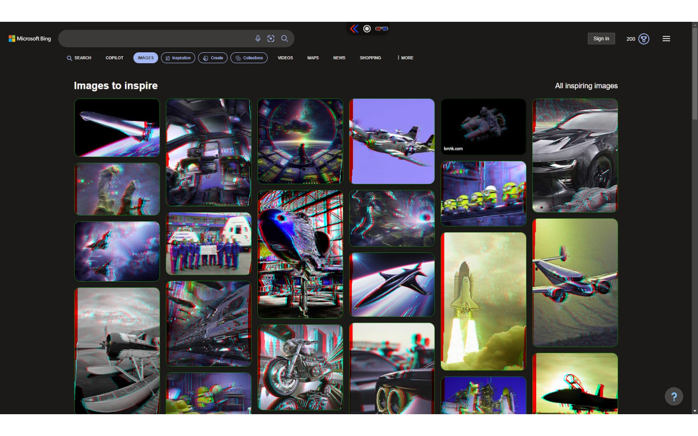
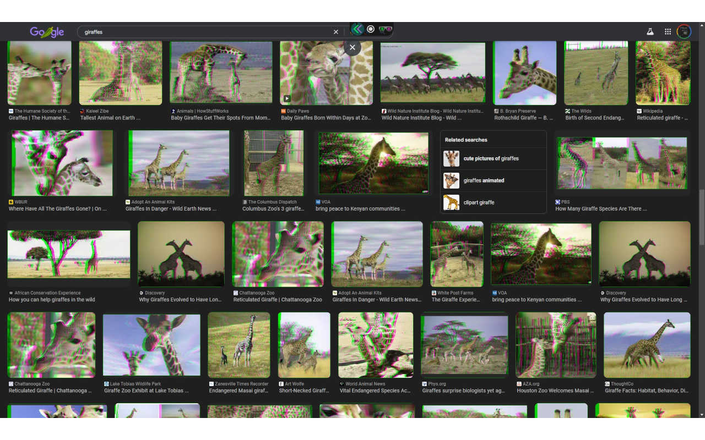

# Anaglyphohol

Anaglyphohol is a browser extension for Chrome, Edge and Firefox that turns the videos and images on web pages into 3D as you browse. Put on a pair of red/cyan 3D glasses, open a video or an image search, and the picture gains depth.

A depth estimation AI works out how far away everything in each picture is, and Anaglyphohol builds a 3D view from that, frame by frame. Everything runs on your own graphics card through WebGPU. Nothing you watch is uploaded anywhere, there is no account, and nothing is tracked. Anaglyphohol is free on every website, with no subscription and no time limit.

## Install
**Download Anaglyphohol 4.0.0 from the [GitHub release](https://github.com/LostBeard/AnaglyphoholV2/releases/tag/v4.0.0).** Step-by-step instructions for Edge, Chrome and Firefox: [INSTALL.md](https://github.com/LostBeard/stupid-at-google/blob/main/INSTALL.md).

- Edge: [Anaglyphohol on Microsoft Edge Add-ons](https://microsoftedge.microsoft.com/addons/detail/anaglyphohol/njohkaaolgfakmollkfjikipedmlapog), or load the 4.0.0 release.
- Chrome and other Chromium browsers: load the 4.0.0 release (extract, then "Load unpacked").
- Firefox: load the 4.0.0 release from `about:debugging`. Firefox 141 or newer.

Requires a browser and a graphics card with WebGPU support.

### Why not the Chrome Web Store?
The Chrome Web Store rejected Anaglyphohol 4.0.0, then denied two appeals, claiming the extension does not use the `storage` and `offscreen` permissions. It uses both. Google was sent the code, line by line, and replied that it could not see it. Version 3.0.14, which Google still serves, requests the same two permissions. Anaglyphohol is leaving the Chrome Web Store. The full record, with every email: **[stupid-at-google](https://github.com/LostBeard/stupid-at-google)**.

## 3D modes
- Red/cyan anaglyph (the most common 3D glasses)
- Green/magenta anaglyph
- 2D+Z (the picture plus its depth map), for glasses-free 3D displays

## The toolbar
A small toolbar sits at the top of each page. Minimized, it is just a pair of arrows. Drag it sideways if it covers something you need; it is back in the middle on the next page.
- 3D on or off everywhere
- 3D images and 3D videos, switched per site
- 3D mode: red/cyan, green/magenta or 2D+Z
- 3D Level: how much depth the scene gets
- 3D Focus: where the screen sits in the scene, so you choose what pops out and what recedes
- Stats: frame rate and depth resolution on each video
- Shortcuts to sites that work well

Your settings are saved, including the 3D level, focus, stats and whether the toolbar is shown on each site.

## Where it works
Popular video sites, live TV channels and image search (YouTube, Twitch, Rumble, Odysee, live TV on Tubi and Pluto TV, and Google, Bing and Yahoo image search) have 3D images and videos switched on from the start. On any other site, switch on 3D images or videos for that site from the toolbar.

Images and videos smaller than 100x100 are skipped. Moving your mouse over an image converts it next.

## Good to know
- After installing or updating, Anaglyphohol prepares its 3D programs for your graphics card once, in the background. Until that is done, the first page with 3D can take a few seconds longer. The welcome page shows a progress bar.
- Copy-protected (DRM) video, used by most paid streaming services, cannot be converted: browsers do not let extensions read those pictures. Free and live channels usually work.
- A few images come from sites that refuse to share them. Those stay 2D.
- Experimental (Chrome only): the "Shared 3D converter" option on the Options page runs one converter in an offscreen document for all your tabs instead of one per page. It is off by default.

## Permissions
- `storage`: saves your settings (3D mode, level, focus, which sites have 3D on, toolbar state) and the Options page settings.
- `offscreen` (Chrome): used only by the optional Shared 3D converter.
- Access to all sites: the extension converts the videos and images on whatever page you visit, so it has to run there and read their pixels. When an image is served from a site that does not let pages read it, the extension downloads that one image from its own address to convert it. Nothing is sent anywhere else.

## How it is built
Anaglyphohol is written in C# with Blazor WebAssembly, using:
- [SpawnDev.SpawnJS](https://github.com/LostBeard/SpawnDev.SpawnJS) for JavaScript interop
- [SpawnDev.SpawnJS.BrowserExtension](https://github.com/LostBeard/SpawnDev.SpawnJS.BrowserExtension) for the extension APIs and the Chrome / Firefox builds
- [SpawnDev.ILGPU](https://github.com/LostBeard/SpawnDev.ILGPU) to run the depth and 3D kernels on the GPU through WebGPU
- [SpawnDev.ILGPU.ML](https://github.com/LostBeard/SpawnDev.ILGPU.ML) to run the depth models

Two depth estimation models ship inside the extension (both Apache-2.0; notices in `Anaglyphohol/wwwroot/licenses`):
- [Depth Anything 3](https://github.com/ByteDance-Seed/Depth-Anything-3) Small for images
- [Video Depth Anything](https://github.com/DepthAnything/Video-Depth-Anything) Small for video: temporally consistent depth, streamed frame by frame

Both ship with their weights stored as FP16 and compute in FP32, which keeps the whole extension around 129 MB compressed, under addons.mozilla.org's 200 MB limit.

## Building
Requires the .NET 10 SDK with the `wasm-tools` workload (`dotnet workload install wasm-tools`).

The models are too big for git. The build fetches any that are missing (`_tools/fetch-models.ps1`): Depth Anything 3 through hub.spawndev.com, and Video Depth Anything from our ONNX export of its streaming step (re-exported from the Small weights when no local export exists; needs Python with torch, onnxruntime, einops, onnx and numpy).

- Release build: run `Anaglyphohol\_buildRelease.bat`. Output goes to `Anaglyphohol\bin\PublishRelease\`: an unpacked `chrome` and `firefox` folder, plus `chrome.zip` and `firefox.zip`.
- Debug build: run `Anaglyphohol\_buildDebug.bat`. Output goes to `Anaglyphohol\bin\PublishDebug\`.

Builds are AOT compiled by default, which takes over an hour. For a faster development build, add `-p:AnaglyphoholAot=false` to the `dotnet publish` command in the bat file.

### Manifest
The extension manifest is `Anaglyphohol\wwwroot\manifest.json`. It is merged with `manifest.chrome.json` for the Chrome build and `manifest.firefox.json` for the Firefox build, so common and browser-specific settings stay separate.

### Loading your build
- Chrome or Edge: open `chrome://extensions` (Edge: `edge://extensions`), enable "Developer mode", click "Load unpacked" and select `bin\PublishRelease\chrome`.
- Firefox: open `about:debugging#/runtime/this-firefox`, click "Load Temporary Add-on..." and select `bin\PublishRelease\firefox\manifest.json`.

## Screenshots
Image search in red/cyan  
  
Image search in green/magenta  

## History
### 2026-10-10
Anaglyphohol 4.0.0 is published on GitHub after the Chrome Web Store rejected it. See [stupid-at-google](https://github.com/LostBeard/stupid-at-google).
### 2026-10-07
AnaglyphoholV2 is released as Anaglyphohol v4.

## Get Support
Issues and feature requests can be submitted [here](https://github.com/LostBeard/AnaglyphoholV2/issues) on GitHub. We are always here to help.

## Support Us
Sponsor us via GitHub Sponsors to give us more time to work on Anaglyphohol and other open source projects. Or buy us a cup of coffee via Paypal. All support is greatly appreciated! ♥

## Thanks
Thank you to everyone who has helped!
